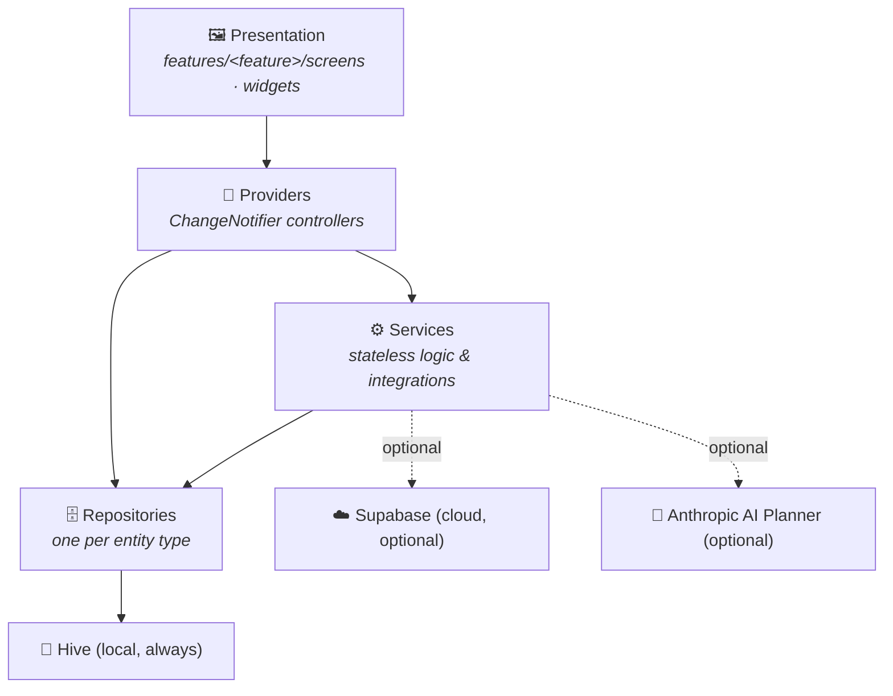

# Architecture

## Contents

- [Overview](#overview)
- [App flow](#app-flow)
- [Folder structure](#folder-structure)
- [Layers](#layers)
- [State management](#state-management)
- [Data layer](#data-layer)
  - [Repositories](#repositories)
  - [Hive (local storage)](#hive-local-storage)
  - [Supabase (optional cloud)](#supabase-optional-cloud)
- [Providers](#providers)
- [Services](#services)
- [Notifications & reminders](#notifications--reminders)
- [Authentication](#authentication)
- [AI Planner](#ai-planner)
- [Security & encryption](#security--encryption)
- [Import / export](#import--export)
- [Graceful degradation for cloud-backed and native features](#graceful-degradation-for-cloud-backed-and-native-features)
- [Testing approach](#testing-approach)
- [Key design decisions](#key-design-decisions-by-phase-latest-first)
- [Known technical debt](#known-technical-debt)

## Overview

ZenTask is a **feature-first, offline-first** Flutter app. Every screen's
data ultimately comes from [Hive](https://pub.dev/packages/hive) on-disk
storage; an optional Supabase backend and an optional Anthropic-backed AI
planner layer on top without ever being required for the app to function.



## App flow

Startup sequence, in order (see `lib/main.dart`, `lib/core/app.dart`,
`lib/core/splash_screen.dart`, `lib/core/root_shell.dart`):

1. **`main()`** installs global error handlers (`FlutterError.onError`,
   `PlatformDispatcher.instance.onError`) that route to the app's
   `CrashReporter`, then calls `HiveService.init()` — which opens every
   Hive box, transparently encrypted if a key already exists (see
   [Security & encryption](#security--encryption)).
2. A best-effort, non-fatal legacy-task migration runs
   (`TaskRepository.migrateLegacyTasksIfNeeded`).
3. Supabase is initialized **only if** real credentials were supplied via
   `--dart-define-from-file` (see [Authentication](#authentication)).
4. `runApp(const MainApp())` — `MainApp`'s `MaterialApp.builder` wraps the
   entire navigator in `AppLockGate`, which shows a full-screen lock
   overlay at startup (and again after backgrounding) whenever biometric
   app lock is enabled, without ever unmounting the screen underneath it.
5. `SplashScreen` shows briefly, then hands off to `RootShell` — the
   bottom-navigation shell hosting the five main tabs (Tasks, Projects,
   Calendar, Analytics, Settings) in an `IndexedStack`, so switching tabs
   never rebuilds a tab from scratch.

## Folder structure

```
lib/
├── core/            # App shell, splash screen, root bottom-nav shell
├── config/          # Compile-time config (cloud credentials, environment flag)
├── models/          # Plain Dart data classes — no Flutter dependency
├── repositories/     # Hive storage access, one per entity type
├── providers/         # ChangeNotifier controllers (business logic)
├── services/          # Stateless logic & integrations, grouped by concern
│   ├── achievements/  ai/              analytics/       calendar_sync/
│   ├── cloud/         crash/           focus/           import_export/
│   ├── integrations/  logging/         reminders/       search/
│   ├── security/      tasks/           telemetry/       timeline/
├── features/          # UI, grouped by feature
│   ├── achievements/  ai_planner/  analytics/  calendar/  focus/
│   ├── goals/         habits/      labels/     projects/  search/
│   └── security/      settings/    tasks/
├── theme/             # Material 3 theming
└── widgets/           # Small shared widgets used across features
```

## Layers

A screen depends on a controller; a controller depends on one or more
repositories/services; a repository depends on a Hive `Box`. Nothing skips
a layer (a screen never opens a `Box` directly), and nothing points
backward (a repository never imports a provider) — with **one documented,
deliberate exception**: `AchievementsEngine` (in `services/`) depends on
`ProjectsController` (a provider), because the alternative was duplicating
`ProjectsController`'s "finished project" logic rather than reusing it.
Reuse won over layering purity there — see the doc comment on
`AchievementsEngine` for the full reasoning.

## State management

Plain `ChangeNotifier` + `notifyListeners()` — **no external state
management package** (no `provider`, Riverpod, Bloc). Two shapes exist,
chosen per controller based on how it's used:

- **Constructed per screen** (most controllers): `ProjectDetailController`,
  `PomodoroController`, etc. Each screen owns its instance, disposes it in
  `dispose()`, and injects fake repositories/services in tests.
- **Lazily-created singleton** (`AppSettingsController`, `AuthController`,
  `AppLockController`, `SyncController`): used when state must be shared
  across screens that aren't in a parent/child relationship — e.g. the
  Settings screen mutates auth state that `SyncController` (elsewhere in
  the tree) needs to observe too. Each singleton keeps a plain, injectable
  constructor underneath (`AppLockController({settingsBox,
  biometricAuthService})`) so its own logic is still unit-testable without
  touching the shared instance, plus a
  `resetInstanceForTesting()`/`setInstanceForTesting()` pair so widget
  tests don't leak state between runs.

## Data layer

### Repositories

One repository per entity type (`TaskRepository`, `ProjectRepository`,
`HabitRepository`, `GoalRepository`, `AchievementRepository`,
`FocusSessionRepository`, `SavedFilterRepository`, `LabelRepository`, ...).
Every repository is the **only** thing allowed to open the Hive `Box` it
owns, and every constructor accepts that box as an optional parameter
(`XRepository({Box? box}) : _box = box ?? HiveService.xBox`) so tests can
inject a temp-dir-backed instance with zero mocking framework involved.

### Hive (local storage)

[Hive](https://pub.dev/packages/hive) — a NoSQL key-value store, no
SQL/ORM. One `Box` per entity type (see `HiveService.allBoxNames` for the
full list); `HabitRepository` owns two (habits, and their daily
completions, stored as `'<habitId>:<yyyy-MM-dd>' -> true`).

**Model evolution is additive-only.** Every new field on an existing model
(e.g. `Task.isPinned`, `Task.labelIds`) gets a default value and is
threaded through the model's full round-trip: `toMap`/`fromMap`/
`copyWith`, and critically, every *other* method that constructs a new
instance of that model directly rather than via `copyWith`. This is a real
bug class, not a hypothetical one: `Task.unassignFromProject()`,
`withoutDueDate()`, and `withoutReminder()` all build a new `Task(...)`
directly (they need to force a field to `null`, which `copyWith`'s
null-means-"leave unchanged" convention can't express), so a newly-added
field silently gets reset to its default every time one of those three
runs — unless it's explicitly added there too. Grep the model's own class
name followed by `(` to find every direct-construction site before
considering a new field "done," and add a round-trip test asserting on the
new field specifically.

### Supabase (optional cloud)

Cloud sync and cloud auth are both **entirely optional** — see
`lib/config/cloud_config.dart`. `Supabase.initialize()` in `main()` is
skipped entirely unless `CloudConfig.hasSupabaseCredentials` is true.
`CloudSyncEngine` infers local deletions by diffing the current local id
set against a snapshot taken at the last successful push (stored per
entity type in the `sync_meta` Hive box), rather than hooking every
repository's `delete()` method — sync logic never leaks into the
repository layer.

## Providers

Business-logic controllers — see [State management](#state-management)
above for the two shapes they come in. Every screen-scoped provider
follows the same skeleton: constructor-injected repositories/services
(defaulting to the real implementation), a set of async mutation methods
that persist via a repository and then `notifyListeners()`, and a
`dispose()` that tears down any subscriptions it created.

## Services

Stateless logic and integrations, grouped by concern under
`lib/services/<concern>/`. Anything that depends on external
configuration or hardware follows the
[graceful degradation](#graceful-degradation-for-cloud-backed-and-native-features)
pattern below.

## Notifications & reminders

`lib/services/reminders/` defines `ReminderScheduler` (interface) and
`LocalNotificationReminderScheduler` (the real implementation, backed by
`flutter_local_notifications` + `timezone`/`flutter_timezone` for
correct local-time scheduling). Reminders are scheduled per-task when a
`Task.reminder` date is set, cancelled when it's cleared or the task is
marked done, and re-registered after a device reboot via the platform
receivers configured in `AndroidManifest.xml`.

## Authentication

`lib/services/cloud/auth_service.dart` defines the `AuthService`
interface and the SDK-independent `AppUser` shape (deliberately not
Supabase's own `User` type, so swapping backends later never touches UI
code). Two implementations:

- **`UnavailableAuthService`** (default, no credentials configured) —
  every method throws a clear `CloudUnavailableException` rather than
  silently no-op-ing.
- **`SupabaseAuthService`** (real) — email + anonymous sign-in fully
  implemented; `signOut()` and `signOutEverywhere()` (Supabase
  `SignOutScope.local`/`.global`) both supported. Google/Apple sign-in
  currently throw the same clear "not configured" exception even in the
  real implementation — no OAuth client credentials are wired in yet.

`AuthController` (a lazily-created singleton provider) wraps whichever
`AuthService` is active and exposes sign-in state to the rest of the app.

## AI Planner

`lib/services/ai/ai_planner.dart` defines the planner interface; the
default is `UnavailableAIPlanner` (returns empty/no-op results, never
throws — a missing AI key shouldn't break the UI). `AnthropicAIPlanner`
activates once `CloudConfig.hasAnthropicApiKey` is true, and covers:
suggesting subtasks, ordering a day's tasks by focus priority, estimating
a task's duration, workload balancing across projects, and generating a
plain-language project summary.

## Security & encryption

Covered in depth by [SECURITY.md](SECURITY.md); the architectural summary:

- **Biometric app lock** (`lib/services/security/biometric_auth_service.dart`,
  `AppLockController`, `AppLockGate`): backed by `local_auth`, gated on
  `isDeviceSupported()` so enabling it never locks a user out on a device
  with no biometric/passcode backend. Auto re-locks after the app has
  been backgrounded past a configurable threshold.
- **AES-256 Hive encryption** (`SecureKeyService` + `HiveEncryptionService`):
  the 256-bit key lives in the platform keychain/keystore via
  `flutter_secure_storage`, never in Hive itself. `HiveService.init()`
  opens every box encrypted whenever a key already exists — a fresh
  install choosing to encrypt from day one needs nothing else. Migrating
  an *existing* unencrypted install (`HiveEncryptionService.enableEncryption`)
  reads every box's contents into memory, deletes the plaintext box files,
  generates a key, reopens every box encrypted, and writes the contents
  back — then requires an app restart, since every repository/controller
  already holding a `Box` reference from before the migration is now
  pointing at a closed box, and this deliberately isn't hot-swapped.
- **Privacy controls**: "sign out everywhere" and "delete all my data"
  (`DataPrivacyService`, clears every box named in
  `HiveService.allBoxNames`).

## Import / export

`lib/services/import_export/` defines `ImportExportService`
(`JsonImportExportService` is the only/default implementation — this is
local-only functionality with no "unavailable" variant needed) covering
full JSON export/import of projects, tasks, and events. A parallel path,
`lib/services/calendar_sync/`, handles `.ics` calendar file export/import
via `IcsCalendarSyncService`; `GoogleCalendarSyncService`/
`AppleCalendarSyncService` scaffolding exists but is currently
`Unavailable` pending OAuth credentials for those providers.

## Graceful degradation for cloud-backed and native features

Every feature that depends on something that might not be configured or
available — cloud credentials, biometric hardware, a real crash-reporting
backend — follows the same shape:

1. An abstract interface (`AuthService`, `BiometricAuthService`,
   `CrashReporter`, `ProductAnalyticsService`, `AICommandService`, ...).
2. A default implementation that's honest about being unavailable —
   either throwing a clear, typed exception (`CloudUnavailableException`)
   or (for logging/telemetry, where failing loudly would be worse than
   useless) quietly doing the local-only thing.
3. A real implementation, chosen automatically based on whether the
   relevant credentials/capability were detected (`CloudConfig.has*`,
   `BiometricAuthService.isAvailable()`).

This means the app never crashes or shows a broken feature just because a
`.json` config file wasn't supplied — it shows a clear, honest message
instead, and running with zero configuration is always a supported,
tested path.

## Testing approach

- **Repositories/services/controllers**: real Hive, in a
  `Directory.systemTemp` temp dir per test, deleted in `tearDown`. No
  mocking framework — real storage, real round-trips.
- **Widget tests**: `flutter_test` + a fake implementation of whatever
  external dependency the screen needs (`FakeAuthService`,
  `FakeReminderScheduler`, ...), injected via each controller's
  constructor or `setInstanceForTesting`.
- Two environment-specific gotchas (not bugs in this app's logic) are
  documented in `DEVELOPER_GUIDE.md`'s Testing section — read that before
  assuming a red test means broken code.

## Key design decisions (by phase, latest first)

- **Enterprise & Release phase** — Achievements are a one-way ratchet:
  once unlocked, `AchievementRepository` persists that fact so an
  achievement stays unlocked even if the data that earned it later
  changes (e.g. a streak resets). `PomodoroController` deliberately owns
  no real `Timer` — it exposes a plain `tick()` the UI's own
  `Timer.periodic` calls once a second, so tests can drive it
  deterministically. `AppLockGate` sits in `MaterialApp.builder` (above
  the Navigator, not inside a single route) so the lock overlay survives
  every push/pop without losing the state underneath it.
- **Cloud sync phase** — Cloud sync diffs the current local id set
  against a snapshot taken at the last push to infer deletions, rather
  than hooking every repository's `delete()` method — keeping sync
  entirely out of the repository layer.
- **Analytics phase** — `AnalyticsEngine`'s streak calculations treat
  "today has no completion yet" as not breaking a streak (the day isn't
  over), but "yesterday and today both empty" as broken.
- **AI Planner phase** — `AppSettingsController` introduced the
  lazily-created-singleton-with-injectable-constructor pattern that every
  later shared controller (`AuthController`, `AppLockController`) now
  follows.
- **Project/task relationships phase** — `unassignFromProject`/
  `withoutDueDate`/`withoutReminder` on `Task` construct a new instance
  directly (not via `copyWith`) so they can force a field to `null`,
  bypassing `copyWith`'s null-means-"leave unchanged" convention. This is
  also exactly why those three methods are the recurring place new `Task`
  fields get silently dropped if a new field is added without also
  touching them — see [Data layer § Hive](#hive-local-storage) above.
- **Foundation phase** — Legacy tasks (`mybox`, `title`+`isDone` only) and
  rich tasks (`task_records`, everything else) are different Hive boxes
  entirely, migrated lazily on first launch
  (`TaskRepository.migrateLegacyTasksIfNeeded`) rather than requiring a
  blocking upfront migration.

## Known technical debt

See [CHANGELOG.md](CHANGELOG.md)'s "Known limitations" section for the
current, maintained list — kept there rather than duplicated here so it
doesn't go stale in two places.
