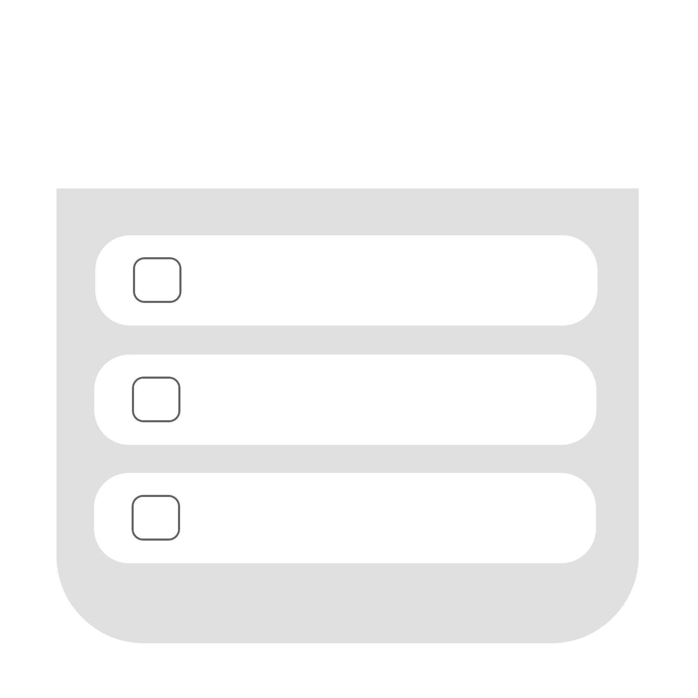
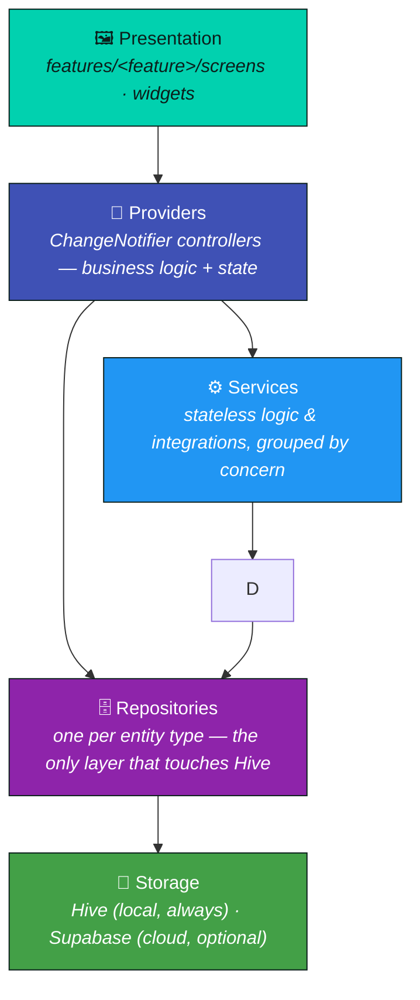

<!--
  Maintainer note (remove this comment once no longer needed):
  Badges/links now point at the real repo (Sanjay7127/zentask). Still to
  update: the LinkedIn/Portfolio links in the Author section, and the
  SECURITY.md / CODE_OF_CONDUCT.md contact emails, all of which are still
  placeholders. Nothing else in this file is fabricated — every feature,
  dependency, and stat referenced below reflects the actual codebase.
-->

<div align="center">



# ZenTask

### AI-powered task & project management, built with Flutter.

Local-first by default. Cloud sync, AI planning, and biometric-locked encryption — entirely optional, entirely yours.

[](https://flutter.dev)
[](https://dart.dev)
[](https://pub.dev/packages/hive)
[](https://supabase.com)
[](ARCHITECTURE.md#state-management)
[](LICENSE)
[](https://github.com/Sanjay7127/zentask/stargazers)
[](https://github.com/Sanjay7127/zentask/issues)
[](https://github.com/Sanjay7127/zentask/pulls)
[](#-platform-support)
[](https://github.com/Sanjay7127/zentask/actions/workflows/ci.yml)
[](test/)

<br />

[**📖 Documentation**](#-documentation) &nbsp;·&nbsp;
[**🎬 Demo**](#-preview) &nbsp;·&nbsp;
[**🐛 Report Bug**](https://github.com/Sanjay7127/zentask/issues/new?labels=bug) &nbsp;·&nbsp;
[**✨ Request Feature**](https://github.com/Sanjay7127/zentask/issues/new?labels=enhancement)

</div>

<br />

## 📋 Table of Contents

- [Preview](#-preview)
- [Screenshots](#-screenshots)
- [Features](#-features)
- [Architecture](#-architecture)
- [Tech Stack](#-tech-stack)
- [Folder Structure](#-folder-structure)
- [Installation](#-installation)
- [Platform Support](#-platform-support)
- [Documentation](#-documentation)
- [Roadmap](#-roadmap)
- [Contributing](#-contributing)
- [License](#-license)
- [Author](#-author)
- [Support](#-support)

<br />

## 🎬 Preview

<div align="center">

> **TODO:** `assets/readme/demo.gif` hasn't been recorded yet — see
> [`assets/readme/README.md`](assets/readme/README.md) for exactly what to
> capture and how. The line below will render automatically once it exists.


</div>

<br />

## 📸 Screenshots

<div align="center">

> **TODO:** screenshots below are placeholders — see
> [`assets/readme/README.md`](assets/readme/README.md) for the full capture
> checklist. Each image tag already points at its final filename.

<table>
  <tr>
    <td align="center" width="25%"><br /><sub><b>Tasks</b></sub></td>
    <td align="center" width="25%"><br /><sub><b>Projects</b></sub></td>
    <td align="center" width="25%"><br /><sub><b>Calendar</b></sub></td>
    <td align="center" width="25%"><br /><sub><b>Analytics</b></sub></td>
  </tr>
  <tr>
    <td align="center" width="25%"><br /><sub><b>Focus Mode</b></sub></td>
    <td align="center" width="25%"><br /><sub><b>Habits</b></sub></td>
    <td align="center" width="25%"><br /><sub><b>Goals</b></sub></td>
    <td align="center" width="25%"><br /><sub><b>Settings</b></sub></td>
  </tr>
  <tr>
    <td align="center" width="25%"><br /><sub><b>Security & Privacy</b></sub></td>
    <td></td>
    <td></td>
    <td></td>
  </tr>
</table>

</div>

<br />

## ✨ Features

Only features that are actually implemented and shipped are listed here.

| Feature | Description |
| --- | --- |
| 🔐 **Authentication** | Email & anonymous sign-in via Supabase Auth. Google/Apple sign-in surface a clear "not configured" message rather than pretending to work — no OAuth credentials are wired in. |
| 📁 **Projects** | Organize tasks into projects with progress tracking, archiving, filters, sort options, and saved filter presets. |
| ✅ **Tasks** | Priority, due dates, reminders, subtasks, tags, custom labels, pinning, and recurrence (daily/weekly/monthly templates). |
| 📅 **Calendar** | Unified view of task due dates, reminders, and events. Import/export as standard `.ics`. |
| 📊 **Analytics** | Productivity snapshots, current/longest completion streaks, per-project completion rates. |
| 🤖 **AI Planner** | Turns a plain-language goal into a structured task plan via Anthropic's API — daily planning, task estimation, workload balancing, project summaries. Degrades gracefully with zero configuration. |
| 🔁 **Habits** | Daily/weekly habit check-ins with streak tracking (same streak algorithm as Analytics). |
| 🎯 **Goals** | Measurable targets with progress bars and quick increment controls. |
| 🏆 **Achievements** | Milestone badges evaluated live against real usage data, unlocked permanently once earned. |
| 🍅 **Focus Mode / Pomodoro** | Work/break timer with session history and Focus Statistics (total sessions, focus minutes, streak-aware daily/weekly counts). |
| 🔔 **Reminders & Notifications** | Local push notifications for due dates and reminders via `flutter_local_notifications`, with reboot-safe rescheduling. |
| 🔒 **Encryption** | Opt-in AES-256 encryption of all local Hive data, with a safe migration path for existing installs. |
| 🧬 **Biometrics** | Optional Face ID / Touch ID / fingerprint app lock, with automatic re-lock after backgrounding. |
| 📤 **Import / Export** | Full JSON data export/import, plus `.ics` calendar import/export. |
| 🔍 **Advanced Search** | Debounced, cross-entity search across tasks, projects, and events with priority/date filters. |
| ♻️ **Recurring Tasks** | Completing a recurring task automatically generates its next occurrence. |
| 🏷️ **Labels** | Custom, color-coded labels attached to any task. |
| 💾 **Saved Filters** | Save a search + filter + sort combination on the Projects screen and reapply it in one tap. |
| 📴 **Offline Storage** | Everything works fully offline — [Hive](https://pub.dev/packages/hive) is the source of truth; cloud sync is a bonus, not a requirement. |
| ☁️ **Optional Cloud Sync** | Supabase-backed account + cross-device sync, entirely opt-in via your own credentials. |
| 🌗 **Dark Theme** | Light / Dark / System theme modes with a user-selectable Material 3 accent color. |
| 🗑️ **Privacy Controls** | "Sign out everywhere" (ends every device's session) and "delete all my data" (irreversible local wipe). |

<br />

## 🏗️ Architecture

ZenTask follows a strict, one-directional layered architecture — a screen
never talks to Hive directly, and a repository never imports a provider.



| Layer | What lives here | Example |
| --- | --- | --- |
| **Presentation** | Widgets. Reads a controller, renders UI, forwards user actions — no business logic. | `features/focus/screens/focus_mode_screen.dart` |
| **Providers** | `ChangeNotifier` controllers holding state + business logic. Constructed per-screen, or a lazily-created singleton when state is genuinely shared (Settings, Auth, App Lock). | `providers/pomodoro_controller.dart` |
| **Services** | Stateless logic and external integrations, grouped by concern. Every cloud/hardware-dependent service has an honest "unavailable" default. | `services/achievements/achievements_engine.dart` |
| **Repositories** | The *only* layer allowed to open a Hive `Box`. One repository per entity type. | `repositories/habit_repository.dart` |
| **Storage** | Hive (always, local) with an optional AES-256 cipher; Supabase (only if credentials are supplied). | `services/hive_service.dart` |

See **[ARCHITECTURE.md](ARCHITECTURE.md)** for the full design-decision log,
including the one documented exception to this layering.

<br />

## 🛠️ Tech Stack

| | Technology | Role |
| --- | --- | --- |
|  | **Flutter** | Cross-platform UI toolkit (Material 3) |
|  | **Dart** | Application language |
|  | **Hive** | Local-first NoSQL storage, with optional AES-256 encryption |
|  | **Supabase** | Optional auth + cross-device sync backend |
|  | **ChangeNotifier** | State management — Flutter's own built-in class, no external package¹ |
|  | **flutter_local_notifications** | Local reminder/notification scheduling |
|  | **local_auth** | Biometric/passcode app lock |
|  | **fl_chart** | Analytics/Focus Statistics charts |
|  | **GitHub Actions** | CI — analyze, test, unsigned Android/iOS build verification |
|  | **Fastlane** | Store-submission lane skeletons (Android + iOS) |

<sup>¹ This project does **not** depend on the `provider` pub package — every
controller extends Flutter's built-in `ChangeNotifier` directly, listened to
via `addListener`/`ListenableBuilder`. See
[ARCHITECTURE.md § State management](ARCHITECTURE.md#state-management).</sup>

<br />

## 📂 Folder Structure

```
zentask/
├── lib/
│   ├── core/            # App shell, splash screen, root bottom-nav shell
│   ├── config/          # Compile-time config (cloud credentials, environment flag)
│   ├── models/           # Plain Dart data classes — no Flutter dependency
│   ├── repositories/      # Hive storage access, one per entity type
│   ├── providers/         # ChangeNotifier controllers (business logic)
│   ├── services/          # Stateless logic & integrations, grouped by concern
│   │   ├── achievements/  ai/  analytics/  calendar_sync/  cloud/
│   │   ├── crash/  focus/  import_export/  logging/  reminders/
│   │   └── search/  security/  tasks/  telemetry/  timeline/
│   ├── features/          # UI, grouped by feature
│   │   ├── achievements/  ai_planner/  analytics/  calendar/  focus/
│   │   ├── goals/  habits/  labels/  projects/  search/  security/
│   │   └── settings/  tasks/
│   ├── theme/             # Material 3 theming
│   └── widgets/           # Small shared widgets used across features
├── test/                  # ~50 test files, 300+ passing tests
├── android/, ios/, web/,
│   macos/, windows/, linux/  # Platform projects
├── .github/workflows/     # CI (GitHub Actions)
└── *.md                   # Documentation (this file + the rest — see below)
```

See **[ARCHITECTURE.md](ARCHITECTURE.md)** for why this shape was chosen.

<br />

## 🚀 Installation

### Requirements

- **Flutter SDK** 3.44+ (developed against `3.44.8`, stable channel)
- **Dart SDK** `>=3.4.1 <4.0.0` (bundled with the Flutter SDK above)
- Android Studio / Xcode only if you intend to build for those platforms

### Clone & run

```bash
git clone https://github.com/Sanjay7127/zentask.git
cd zentask

flutter pub get
flutter run
```

The app runs with **zero configuration**. Every cloud-backed feature (AI
Planner, cloud sync) detects missing credentials and falls back to a
local-only implementation automatically — see
**[DEVELOPER_GUIDE.md § Environment configuration](DEVELOPER_GUIDE.md#environment-configuration)**
to enable them with your own keys.

### Verify your setup

```bash
flutter analyze   # static analysis — should report 0 errors
flutter test      # 300+ tests across models, repositories, providers, services, widgets
```

<br />

## 📱 Platform Support

| Platform | Status | Notes |
| --- | --- | --- |
| 🤖 Android | ✅ Supported | `dev`/`prod` build flavors configured; CI builds an unsigned debug APK on every push |
| 🍏 iOS | ✅ Supported | CI builds an unsigned debug archive (`--no-codesign`, best-effort) |
| 🌐 Web | ✅ Supported | `flutter build web` verified |
| 🖥️ macOS | ⚠️ Scaffolded | Project files present; not exercised in CI yet |
| 🪟 Windows | ⚠️ Scaffolded | Project files present; not exercised in CI yet |
| 🐧 Linux | ⚠️ Scaffolded | Project files present; not exercised in CI yet |

<br />

## 📚 Documentation

| Document | Covers |
| --- | --- |
| **[ARCHITECTURE.md](ARCHITECTURE.md)** | Layers, state management, storage, encryption, and the key design decisions behind them |
| **[DEVELOPER_GUIDE.md](DEVELOPER_GUIDE.md)** | Environment setup, build flavors, testing gotchas, CI/CD, releases |
| **[CONTRIBUTING.md](CONTRIBUTING.md)** | Project setup, coding standards, branch/commit naming, PR process |
| **[CHANGELOG.md](CHANGELOG.md)** | Version history in Keep a Changelog format |
| **[MIGRATION_GUIDE.md](MIGRATION_GUIDE.md)** | Safely evolving the local data model; the encryption migration in detail |
| **[SECURITY.md](SECURITY.md)** | Supported versions, reporting a vulnerability, disclosure policy |
| **[STORE_READINESS.md](STORE_READINESS.md)** | What's done vs. outstanding before an app-store submission |

<br />

## 🗺️ Roadmap

### ✅ Completed

- Tasks, Projects, Labels, Recurring Task templates, Saved Filters
- Calendar with `.ics` import/export
- AI Planner (Anthropic) — daily planning, estimation, workload balancing
- Analytics — streaks, productivity snapshots, per-project rates
- Focus Mode / Pomodoro, Habits, Goals, Achievements
- Optional Supabase cloud sync + accounts
- Biometric app lock, AES-256 local encryption, privacy controls
- CI/CD (GitHub Actions), Fastlane skeletons, Android build flavors

### 🔭 Planned

- [ ] Google / Apple OAuth sign-in
- [ ] Home-screen widgets & OS quick-actions (Android/iOS)
- [ ] Additional AI providers (OpenAI, Gemini) alongside Anthropic
- [ ] Verified desktop builds (macOS, Windows, Linux) in CI
- [ ] WearOS companion app
- [ ] Apple Watch companion app
- [ ] Voice assistant integration

<br />

## 🤝 Contributing

Contributions are what make the open-source community such an amazing place
to learn, inspire, and create. Any contribution you make is **greatly
appreciated**.

1. Fork the repo and create your branch from `main`
2. Read **[CONTRIBUTING.md](CONTRIBUTING.md)** for coding standards, branch/commit naming, and the PR checklist
3. Make your change, add/update tests, and confirm `flutter analyze` + `flutter test` pass
4. Open a pull request describing *why*, not just *what*

Please also read our **[Code of Conduct](CODE_OF_CONDUCT.md)** before
participating.

<br />

## 📄 License

Distributed under the **MIT License**. See **[LICENSE](LICENSE)** for the
full text.

<br />

## 👤 Author

<div align="center">

**Your Name**

[](https://linkedin.com/in/your-profile)
[](https://github.com/Sanjay7127)
[](https://your-portfolio.example.com)

</div>

<br />

## 💖 Support

If ZenTask helped you or you just like what's here:

- ⭐ **[Star this repository](https://github.com/Sanjay7127/zentask)** — it genuinely helps visibility
- 🐛 **[Open an issue](https://github.com/Sanjay7127/zentask/issues)** for bugs or feature requests
- 💬 **[Start a discussion](https://github.com/Sanjay7127/zentask/discussions)** for questions or ideas

<div align="center">

Made with 💚 and Flutter.

</div>
